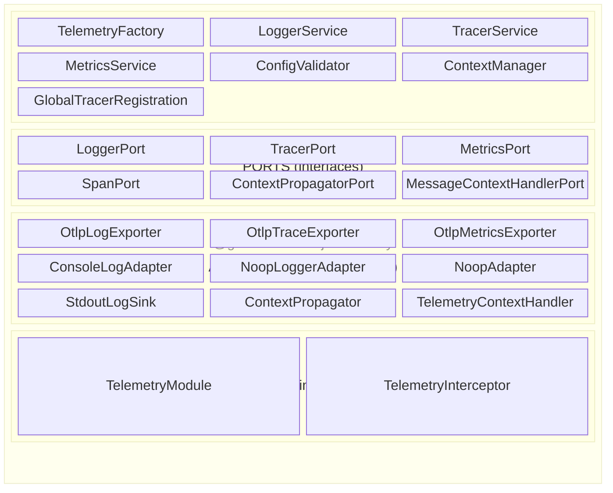
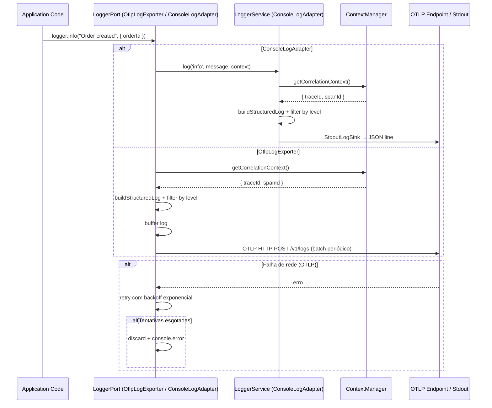
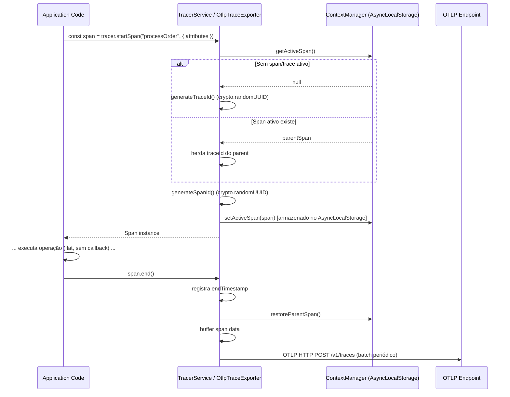
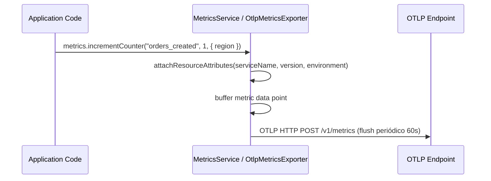
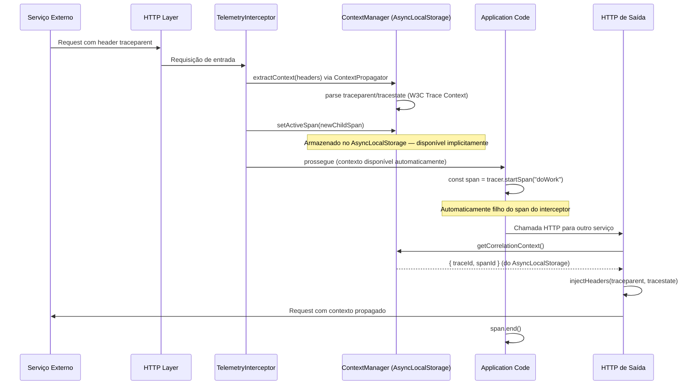
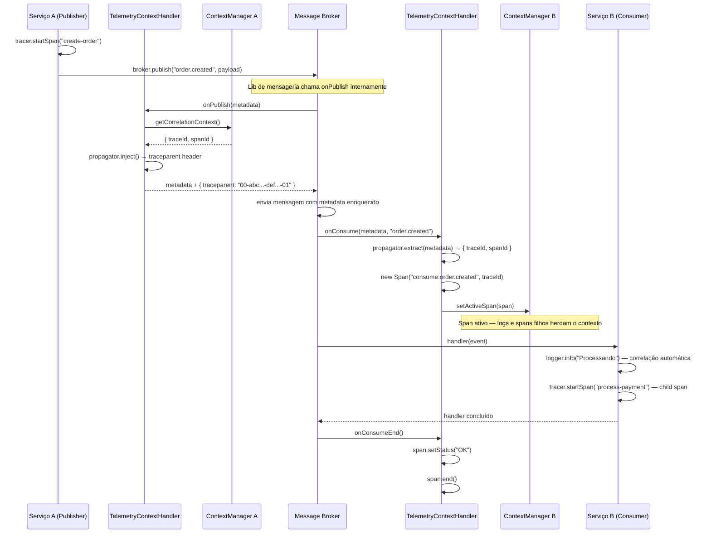

# Arquitetura

## Visão Geral

A biblioteca segue a arquitetura hexagonal (ports & adapters). O core contém a lógica de telemetria pura e define interfaces (ports) para os três pilares de observabilidade. Adapters concretos implementam esses ports para plataformas específicas (OTLP, console, noop).



## Diagrama de Componentes

```mermaid
graph TB
    subgraph "Core"
        TF[TelemetryFactory]
        LS[LoggerService]
        TS[TracerService]
        MS[MetricsService]
        CV[ConfigValidator]
        CM[ContextManager]
        GTR[GlobalTracerRegistration]
    end

    subgraph "Ports"
        LP[LoggerPort]
        TP[TracerPort]
        MP[MetricsPort]
        SP[SpanPort]
        CPP[ContextPropagatorPort]
    end

    subgraph "Adapters"
        OLE[OtlpLogExporter]
        OTE[OtlpTraceExporter]
        OME[OtlpMetricsExporter]
        CLA[ConsoleLogAdapter]
        NLA[NoopLoggerAdapter]
        NA[NoopAdapter]
        CP[ContextPropagator]
        LAF[LoggerAdapterFactory]
    end

    subgraph "NestJS"
        TM[TelemetryModule]
        TI[TelemetryInterceptor]
    end

    subgraph "OpenTelemetry API (global)"
        OTEL_API["@opentelemetry/api"]
        NTP[NodeTracerProvider]
        W3C[W3CTraceContextPropagator]
    end

    subgraph "Microsserviço Consumidor"
        SVC[UserService]
        CTRL[Controller]
    end

    SVC -->|injeta| LP
    SVC -->|injeta| TP
    SVC -->|injeta| MP
    CTRL -->|interceptado por| TI

    TM -->|registra| LAF
    LAF -->|cria| OLE
    LAF -->|cria| CLA
    LAF -->|cria| NLA
    TM -->|registra| OTE
    TM -->|registra| OME
    TM -->|chama| GTR

    TF -->|cria via| LAF
    TF -->|cria| OTE
    TF -->|cria| OME
    TF -->|chama| GTR

    GTR -->|provider.register| OTEL_API
    GTR -->|cria| NTP
    GTR -->|configura| W3C

    LS --> LP
    TS --> TP
    MS --> MP
    TS --> SP
    CM --> CPP

    OLE -.->|implements| LP
    OTE -.->|implements| TP
    OME -.->|implements| MP
    CLA -.->|implements| LP
    CLA -->|compõe| LS
    NLA -.->|implements| LP
    NA -.->|implements| LP
    NA -.->|implements| TP
    NA -.->|implements| MP
end
```

## Fluxo de Emissão de Log



## Fluxo de Criação de Trace (API Flat)



## Fluxo de Registro de Métricas



## Fluxo de Propagação de Contexto (Implícita via AsyncLocalStorage)



## Fluxo de Propagação de Contexto via Eventos (TelemetryContextHandler)



## Decisões de Design

### 1. API Flat (start/end) — sem wrapping de callbacks

A API de tracing usa o padrão explícito `startSpan` / `span.end()` em vez de funções que envolvem callbacks como `withSpan`, `withTrace` ou `withContext`. Isso evita:

- **Nesting de callbacks** que prejudica a legibilidade
- **Indentação excessiva** em operações sequenciais com múltiplos spans
- **Dificuldade de refatoração** quando lógica precisa ser extraída para funções separadas

```typescript
// ✅ API flat — como a biblioteca funciona
const span = tracer.startSpan('processOrder');
span.setAttribute('orderId', order.id);

const result = await orderService.process(order);
await paymentService.charge(order.total);

span.end();
```

### 2. Propagação implícita via AsyncLocalStorage

O `ContextManager` usa `AsyncLocalStorage` do Node.js internamente para propagar o contexto de trace automaticamente. Qualquer código executando no mesmo fluxo assíncrono tem acesso ao span ativo sem precisar:

- Passar o span como parâmetro entre funções
- Envolver código em callbacks de contexto
- Gerenciar manualmente a hierarquia de spans

```typescript
const parentSpan = tracer.startSpan('handleRequest');

// Qualquer span criado aqui herda o traceId do parent automaticamente
await processOrder(order);

parentSpan.end();

async function processOrder(order: Order) {
  const span = tracer.startSpan('processOrder'); // filho automático
  // ...
  span.end();
}
```

### 3. Core framework-independent

O core não importa `@nestjs/*` nem nenhum framework HTTP/DI. Isso permite:
- Usar em contextos não-NestJS (workers, scripts, lambdas) via `TelemetryFactory`
- Testar sem bootstrap de framework
- Extrair como biblioteca npm independente

### 4. Adapters como classes puras

Os adapters são classes TypeScript puras sem decorators de framework. O `TelemetryModule` do NestJS registra-os como providers via factory, mantendo o core independente de DI container.

### 5. Telemetria nunca crasha a aplicação

Todos os métodos dos ports (exceto inicialização) são fail-safe: erros de export são capturados internamente, logados via console, e os dados são descartados. A aplicação continua funcionando normalmente mesmo se a plataforma de observabilidade estiver indisponível.

### 6. Configuração fail-fast

Erros de configuração (campos obrigatórios ausentes, valores inválidos) lançam `InvalidConfigurationError` imediatamente na inicialização. Isso previne que a aplicação rode com telemetria quebrada silenciosamente.

### 7. Módulo global no NestJS

O `TelemetryModule` é registrado como `@Global()` para que os ports (`LOGGER_PORT`, `TRACER_PORT`, `METRICS_PORT`) estejam disponíveis em todos os módulos sem necessidade de re-importação.

### 8. Span restaura contexto anterior ao finalizar

Quando `span.end()` é chamado, o `ContextManager` restaura o span anterior (pai) como span ativo:

```typescript
const parent = tracer.startSpan('handleRequest');
  const child = tracer.startSpan('queryDatabase');
  child.end(); // restaura parent como span ativo
parent.end();
```

### 9. W3C Trace Context para propagação entre serviços

O `ContextPropagator` segue a especificação W3C Trace Context para serializar/desserializar contexto em headers HTTP:
- `traceparent`: `{version}-{trace-id}-{parent-id}-{trace-flags}`
- `tracestate`: metadados vendor-specific opcionais

Isso garante interoperabilidade com qualquer sistema que siga o padrão W3C.

### 10. OTLP como protocolo de export

Todos os exporters usam o protocolo OTLP (OpenTelemetry Protocol) via HTTP JSON. Isso garante compatibilidade com qualquer backend OTLP-compatível (Grafana Cloud, Datadog, New Relic, Jaeger, etc.) sem necessidade de adapters específicos por plataforma.

### 11. Registro global do TracerProvider e Propagator via @opentelemetry/api

Na inicialização (via `TelemetryFactory.create()` ou `TelemetryModule.forRoot()`), a lib registra um `NodeTracerProvider` global e um `W3CTraceContextPropagator` usando a API singleton do `@opentelemetry/api`. Isso garante que:

- `trace.getTracer()` retorna tracers reais (não noop)
- `propagation.inject(context.active(), carrier)` serializa `traceparent`/`tracestate` no carrier
- Qualquer lib que dependa da API global do OpenTelemetry (ex: `@gsomenzi/nodejs-messaging`) funciona corretamente

Sem esse registro, a `@opentelemetry/api` usa implementações noop por padrão, fazendo com que `propagation.inject()` produza carriers vazios `{}`.

O registro é idempotente — chamadas múltiplas são seguras. O shutdown do provider é feito em `TelemetryFactory.shutdown()`.

### 12. Propagação em eventos via slot pattern (MessageContextHandlerPort)

O `TelemetryContextHandler` implementa um padrão de "slot" para propagação de contexto em sistemas de mensageria. A lib de telemetria não conhece o broker (Kafka, SQS, RabbitMQ) — ela apenas sabe injetar/extrair `traceparent` de um `Record<string, string>`. A lib de mensageria não conhece telemetria — ela apenas chama os métodos do handler nos momentos certos.

Isso permite:
- **Desacoplamento total** — nenhuma lib depende da outra diretamente
- **Opt-in** — se nenhum handler for fornecido, a mensageria funciona sem telemetria
- **Extensibilidade** — qualquer implementação de `MessageContextHandlerPort` pode ser plugada (não apenas telemetria)
- **Testabilidade** — fácil de mockar em testes unitários

### 13. Batching e flush periódico

Os exporters OTLP acumulam dados em buffer e fazem flush periódico:
- **Logs**: flush a cada 5s ou quando batch atinge 100 entries
- **Traces**: flush a cada 5s ou quando batch atinge 512 spans
- **Métricas**: flush a cada 60s

Timers são `unref()`'d para não impedir o encerramento do processo.

## Extensibilidade

### Seleção de adaptador de logger (built-in)

Use `loggerAdapter` na configuração ou `createLoggerAdapter()` programaticamente:

```typescript
import { TelemetryModule } from '@gsomenzi/nodejs-telemetry';

TelemetryModule.forRoot({
  serviceName: 'my-service',
  environment: 'development',
  loggerAdapter: 'console', // 'otlp' | 'console' | 'noop'
  exporter: { endpoint: 'https://otlp.example.com/otlp' },
});
```

| Valor | Classe | Comportamento |
|-------|--------|---------------|
| `'otlp'` (padrão) | `OtlpLogExporter` | Envia logs para endpoint OTLP |
| `'console'` | `ConsoleLogAdapter` | JSON estruturado no stdout |
| `'noop'` | `NoopLoggerAdapter` | Descarta logs |

### Adaptador de logger customizado

Para adicionar uma nova implementação de logger:

1. Implemente `LoggerPort`, **ou**
2. Componha `LoggerService` + um `LogHandler` (sink) customizado
3. Passe via `logger` no `TelemetryModule.forRoot()` ou `TelemetryFactory.create(config, { logger })`

```typescript
TelemetryModule.forRoot({
  serviceName: 'my-service',
  environment: 'production',
  logger: new MyCustomLoggerAdapter(),
  exporter: { endpoint: 'https://otlp.example.com/otlp' },
});
```

### Substituindo todos os ports (NestJS avançado)

Para substituir logger, tracer e metrics de uma vez:

```typescript
import { Module } from '@nestjs/common';
import { LOGGER_PORT, TRACER_PORT, METRICS_PORT } from '@gsomenzi/nodejs-telemetry';

@Module({
  providers: [
    { provide: LOGGER_PORT, useClass: MyCustomLoggerAdapter },
    { provide: TRACER_PORT, useClass: MyCustomTracerAdapter },
    { provide: METRICS_PORT, useClass: MyCustomMetricsAdapter },
  ],
  exports: [LOGGER_PORT, TRACER_PORT, METRICS_PORT],
})
export class CustomTelemetryModule {}
```

Para desabilitar telemetria completamente:

```typescript
import { NoopAdapter } from '@gsomenzi/nodejs-telemetry';

// O NoopAdapter implementa LoggerPort, TracerPort e MetricsPort como no-ops
const noop = new NoopAdapter();
```
